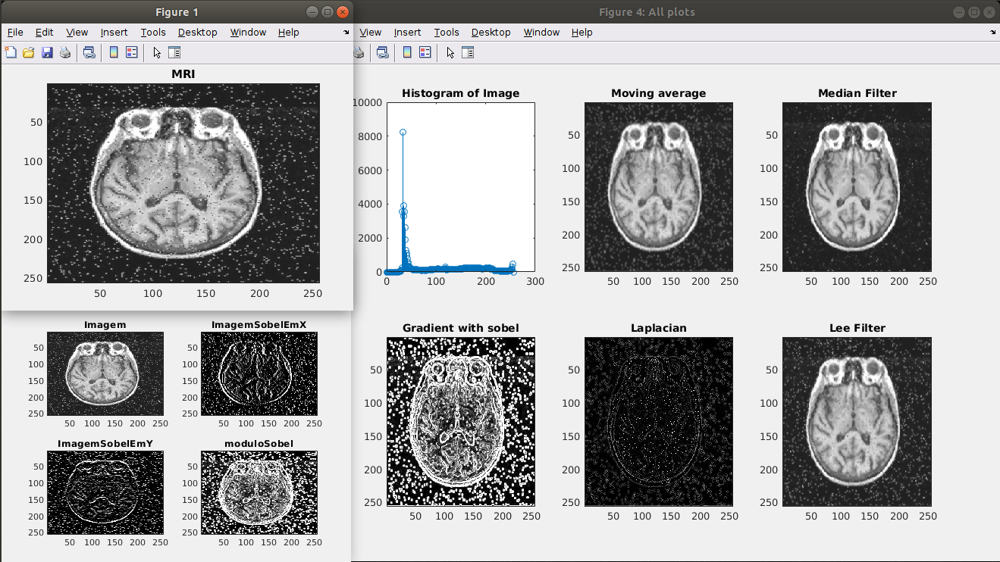

# Imagens Biomedicas
This repository contains all the medical image processing algorithms studied in discipline "Imagens Biomédicas" of Biomedical Engineering course at UNIFESP in the first semester of 2017. All the algorithms are writen in both MatLab and Python Languages. The programatric content of the discipline can be found [here](https://unifesp.br/campus/sjc/images/sjc/Secretaria_de_Graduação/UCs_Vigentes/I/Imagens_Biomédicas.pdf).

# Getting Started

**Prerequisites**

To run the algorithms in this repo, you'll need to have either MatLab (or Octave) or Python 3 or both installed.

# Algorithms

The algorithms studied in this discipline are divided in the folowing groups:

### First Steps
- Open image
- Build Histogram

### Filtering masks (Restauration and enhancement)
- Moving Average
- Weighted Moving Average
- Gaussian Moving Average
- Median
- Edge Enhancement
- Gradient (Prewitt and Sobel)
- Laplacian

### Transforms and Frequency Domain Filtering
- Polar Transform (Cartesian to Polar domain)
- Cartesian Transform (Polar to Cartesian domain)
- Fast Fourier Transform (FFT) 2D
- Ideal Filter LP and HP
- ButterWorth  Filter LP and HP
- Gaussian Filter LP and HP

### Adaptive Filtering
- Lee's Filter

### Noise Analysis
- Maximum error
- Root mean square error
- Image Quality Factor

# Built With
- [Anaconda](https://www.anaconda.com): Solutions for Data Science Practitioners and Enterprise Machine Learning.

- [MatLab](https://www.mathworks.com): A software for numerical computation.
